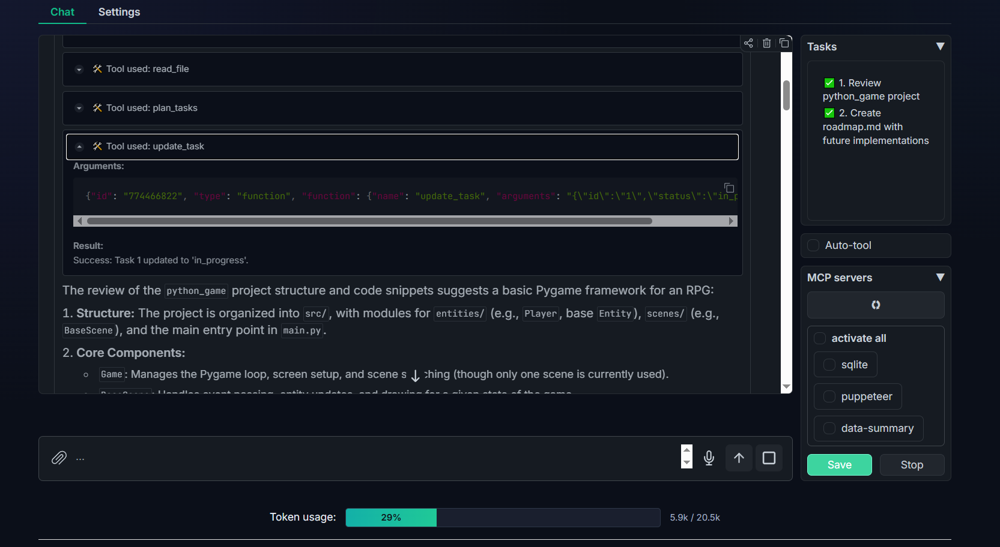

# MCP Client — Local Agent Harness (Learning Project)

> **This is a personal learning project.** Not production-ready. Not intended for public use. Security vulnerabilities exist by design of the learning scope — see [Security](#security) below.

A local agentic harness built around the [Model Context Protocol (MCP)](https://modelcontextprotocol.io/). Connects to one or more MCP servers, exposes their tools to an LLM, and lets you chat with the agent in a browser — with per-tool-call approval controls.

Built to understand how LLM agent loops, tool orchestration, task planning, context management, and memory actually work at the code level.

---

## What It Does

- **MCP server integration** — connect to any MCP server (filesystem, web search, custom tools) via `servers_config.json`
- **Agentic loop** — LLM decides which tools to call, executes them, feeds results back, loops until a final answer
- **Tool approval gate** — every tool call pauses for Allow / Deny / Always-allow before execution
- **Task planning** — agent can break work into tasks (`plan_tasks`, `update_task`, `add_task`); live sidebar shows the plan
- **Planner pass** — optional upfront LLM call restricted to planning only, before the main loop starts
- **File tools** — built-in `list_files`, `read_file`, `replace_lines`, `bash` scoped to a configured base directory
- **Bash tool** — runs commands via WSL (`wsl.exe bash -s`, passed via stdin); Windows paths auto-mapped to `/mnt/...`
- **Skills system** — extend the LLM with specialised instructions or callable Python functions via `mcp_chatbot/skills/`
- **Multimodal input** — accepts text files and images alongside chat messages
- **Mission brief** — static `plan.md` in workspace root injected into every system prompt
- **Token budget tracker** — per-category token estimates (system / tools / history); triggers rolling summarization at 70% context
- **Rolling summarization** — compresses old turns into a `[Summary]:` block to keep context within limits
- **Token usage display** — segmented progress bar in UI showing system / tools / history usage with color thresholds
- **Episodic memory** — SQLite-backed episode store; last N sessions injected as `[Memory]:` block at startup
- **Key facts store** — agent-writable persistent facts (`remember_fact`, `update_fact`, `forget_fact`); top-N injected at startup ranked by time-decay score; IDs shown for direct update without search round-trip
- **Memory search** — `search_memory` tool: FTS5 BM25 on episodes + key facts, LIKE fallback on syntax error
- **Semantic memory server** — standalone MCP subproject (`memory_server/`) exposing a `search_memory` tool with three-pass retrieval: cosine similarity on stored embeddings (`BAAI/bge-small-en-v1.5` via LM Studio), FTS5 BM25 keyword search, and spaCy (`en_core_web_sm`) entity/noun-chunk score boost; lazy backfill embeds missing episodes on first call; gracefully degrades to keyword-only if embedding endpoint is unreachable, and skips entity boost if spaCy is absent
- **Playbook / procedural memory** — persistent workflow store; auto-triggered after all tasks complete; top-N procedures injected into system prompt by confidence score; dedup via SequenceMatcher (Incomplete, simple system prompt injection for now, will tie up with task planning in the future.)
- **Gradio UI** — browser-based chat with sidebar for server selection, task list, memory, and playbook tabs (optimized for personal use only)

---

## Stack

- Python 3.10+, `uv` for package management
- [Gradio](https://gradio.app/) for the web UI
- [MCP Python SDK](https://github.com/modelcontextprotocol/python-sdk) for server connections
- `httpx` for LLM API calls (OpenAI-compatible endpoint)
- LM Studio (local) or Groq (cloud) as the LLM backend

---

## Running

```bash
# Install dependencies
uv sync

# Start the app
uv run mcp_chatbot/frontend/app.py
```

Opens at `http://localhost:7860`.

### LLM Backend

Configured in `mcp_chatbot/core/config.py`:

| `local_model` | Endpoint | Model |
|---|---|---|
| `True` | `http://localhost:1234/v1` (LM Studio) | `model-identifier` |
| `False` | Groq API | `meta-llama/llama-4-scout-17b-16e-instruct` |

Set `LLM_API_KEY` in `mcp_chatbot/.env` for cloud mode.

### MCP Servers

Edit `mcp_chatbot/servers_config.json`:

```json
{
  "mcpServers": {
    "my-server": {
      "command": "uvx",
      "args": ["my-mcp-server"],
      "timeout": 30.0
    }
  }
}
```

Servers must be checked in the UI sidebar to activate them.

### Semantic Memory Server

`memory_server/` is a standalone `uv` subproject (isolates `numpy` and `spacy` from the main app). Register it in `servers_config.json`:

```json
{
  "mcpServers": {
    "memory": {
      "command": "uv",
      "args": [
        "--directory", "memory_server",
        "run", "server.py",
        "--embed-url", "http://localhost:1234",
        "--embed-model", "text-embedding-bge-small-en-v1.5"
      ]
    }
  }
}
```

| Arg | Default | Notes |
|---|---|---|
| `--embed-url` | `http://localhost:1234` | LM Studio base URL (any OpenAI-compatible embedding endpoint works) |
| `--embed-model` | `text-embedding-bge-small-en-v1.5` | Model served by LM Studio (`BAAI/bge-small-en-v1.5`) |
| `--db-path` | auto | Defaults to `<file_root>/.agent/memory.db` read from `settings.json` |

**spaCy:** `pip install spacy && python -m spacy download en_core_web_sm`. Optional — entity boost skipped if absent, retrieval still works.

**Graceful degradation:** embedding endpoint unreachable → semantic pass skipped, keyword (FTS5/LIKE) still runs. spaCy absent → entity boost skipped.

**Suppression:** when this server is active, the main app's local `search_memory` tool is excluded from the LLM schema — the MCP version wins.

---

## Project Layout

```
mcp_chatbot/
  core/
    config.py          # Configuration
    context_manager.py # ContextManager — token budget tracker + compression trigger
    llm_client.py      # LLMClient (httpx, streaming + non-streaming)
    server.py          # Server, Tool (MCP lifecycle)
    session.py         # ChatSession (agentic loop)
    task_manager.py    # TaskManager (plan/track tasks)
  frontend/
    app.py             # Gradio UI
    multimodal.py      # Image/file input handling
    schemas.py         # Pydantic models
  tools/
    file_manager.py    # FileManager (list/read/replace_lines/bash)
    skills_manager.py  # SkillsManager
  memory/
    store.py           # EpisodicStore (SQLite — episodes + key_facts + FTS5)
    memory_manager.py  # MemoryManager (remember_fact, update_fact, forget_fact, search_memory)
    playbook.py        # PlaybookManager (procedural memory, record_procedure)
  skills/              # Skill definitions (SKILL.md + optional scripts.py)
  settings.py          # settings.json load/save
memory_server/         # Standalone MCP server — semantic search (numpy, spaCy, embeddings)
```

---

## Skills

Skills extend the agent with specialised knowledge or callable Python functions. Drop a folder under `mcp_chatbot/skills/` with:

- `SKILL.md` — YAML frontmatter (`name`, `description`) + markdown instructions
- `scripts.py` (optional) — Python functions + `DISPATCH` dict; type hints and docstrings become the tool schema

The LLM sees skill names and descriptions in its system prompt, calls `read_skill()` to load a skill, then calls skill functions as normal tool calls.

---

## Security

**This project has known security issues that are intentional to the learning scope.**

- **Bash tool runs unsandboxed WSL commands.** Any prompt injection or malicious tool result could execute arbitrary shell commands.
- **File tool has no authentication.** Anyone with access to the Gradio URL can read/edit files within `file_root`.
- **Tool approval gate is the only guardrail.** "Always-allow" (Auto-tool) mode bypasses it entirely.
- **No input sanitisation** on MCP tool results before they enter the LLM context.
- **Gradio runs without auth** — do not expose to public networks.

Do not run this against sensitive directories or on a shared/public machine.

---

## Roadmap

- **Next** — Tasks + Playbook redesign: hierarchical task→steps structure, loop safety guards, on-demand playbook retrieval.
- **Agent loop hardening** — Auto-compaction check at turn start (not just pre-LLM-call) , typed event model, state persistence, reasoning effort control, feedback layer, progressive tool disclosure.
- **CLI & API surface** — `python -m mcp_chatbot.cli`, FastAPI endpoint, MCP/Agent cards.
- **Multi-agent patterns** — Orchestrator/worker, parallel fan-out, A2A compatibility.

---

#### Gradio UI:

